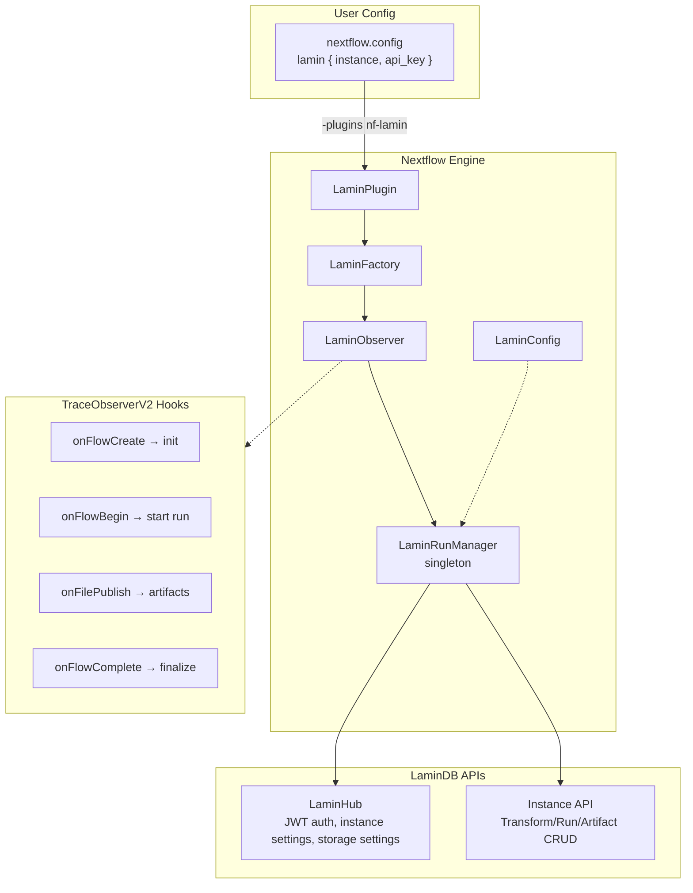

# nf-lamin AI Agent Instructions

## Project Overview

**nf-lamin** is a Nextflow plugin that provides automatic data provenance tracking via LaminDB. It captures workflow executions, parameters, code versions, and input/output files as structured metadata without requiring user code changes.

**Key Goal**: Create Transform records (pipeline definitions) and Run records (executions) in LaminDB, tracking published artifacts for complete lineage.

## Architecture



### Core Files

| File                       | Purpose                                              |
| -------------------------- | ---------------------------------------------------- |
| `LaminPlugin.groovy`       | Entry point, extends `BasePlugin`                    |
| `LaminFactory.groovy`      | Creates `LaminObserver` via `TraceObserverFactory`   |
| `LaminObserver.groovy`     | Implements `TraceObserverV2` lifecycle hooks         |
| `LaminRunManager.groovy`   | Singleton managing state (transform, run, artifacts) |
| `LaminConfig.groovy`       | Config scope with `@ScopeName('lamin')`              |
| `hub/LaminHub.groovy`      | JWT auth + instance settings from laminhub.com       |
| `instance/Instance.groovy` | REST API client for LaminDB instance                 |

### Observer Lifecycle

```groovy
onFlowCreate(Session)  → initializeRunManager() → connect to LaminDB
onFlowBegin()          → startRun() → create Transform + Run records
onFilePublish(event)   → createOutputArtifact() → track published files
onFlowComplete()       → finalizeRun() → set status COMPLETED/ERRORED
```

## Development Workflows

### Build & Test

```bash
make assemble          # Build plugin JAR
make test              # Run unit tests (Spock framework)
make install           # Install to ~/.nextflow/plugins/
make validate          # Run validation workflow (requires LAMIN_API_KEY)
./gradlew test --tests "LaminRunManagerTest"  # Single test class
```

### Local Development

Different features require different test workflows. Here are a few examples:

```bash
# Build and install with unreleased version (set in build.gradle)
make && make install

# Run validation workflow with trace logging
NXF_VER=25.10.0 nextflow \
  -trace ai.lamin \
  run laminlabs/nf-lamin \
  -main-script validation/main.nf \
  -latest \
  -resume

# Test with external workflow (successful run)
NXF_VER=25.10.0 nextflow \
  -trace ai.lamin \
  run https://packages.viash-hub.com/vsh/toolbox \
  -r v0.1.1 \
  -main-script target/nextflow/bgzip/main.nf \
  -profile docker \
  -latest \
  -resume \
  --input https://example.com/file.txt \
  --output output.txt.bgz \
  --publish_dir $LAMIN_TEST_BUCKET/scratch/run_$(date +%Y%m%d_%H%M%S)

# Test error handling (workflow that fails)
NXF_VER=25.10.0 nextflow \
  -trace ai.lamin \
  run https://packages.viash-hub.com/vsh/toolbox \
  -r v0.1.1 \
  -main-script target/nextflow/yq/main.nf \
  -profile docker \
  --input input.txt \
  --eval '.name = "foo"'
```

**Tips:**

- Always use `-trace ai.lamin` to capture debug logs without re-running
- Use unreleased version number in `build.gradle` during development

### Integration Tests

Tests in `LaminObserverIntegrationTest.groovy` require environment variables:

- `LAMIN_API_KEY` – Production API key
- `LAMIN_STAGING_API_KEY` – Staging API key
- `LAMIN_TEST_BUCKET` – Remote bucket (s3:// or gs://) for artifact tests

Tests use `@Requires({ hasEnvVars(['LAMIN_API_KEY']) })` to auto-skip.

## Code Conventions

### Groovy Style

- **`@CompileStatic`**: Use on all classes for performance (required by Nextflow plugin SDK)
- **`@Slf4j`**: Standard logging annotation; use `log.debug`, `log.info`, `log.error`
- **Safe navigation**: `object?.property` instead of null checks
- **License headers**: Apache 2.0 required on all source files

### Testing (Spock Framework)

```groovy
def "should create run with correct metadata"() {
    given:
    def config = new LaminConfig([instance: 'org/test', api_key: 'key'])

    when:
    def run = manager.initializeRun()

    then:
    run.uid != null
}
```

### Plugin Registration (`build.gradle`)

```gradle
nextflowPlugin {
    nextflowVersion = '25.04.0'  // Minimum version (TraceObserverV2)
    className = 'ai.lamin.nf_lamin.LaminPlugin'
    extensionPoints = [
        'ai.lamin.nf_lamin.LaminExtension',
        'ai.lamin.nf_lamin.LaminFactory',
        'ai.lamin.nf_lamin.LaminConfig'
    ]
}
```

## LaminDB API Integration

### Two-Layer Architecture

1. **Lamin Hub** (`hub/LaminHub.groovy`): laminhub.com Supabase API
   - `fetchAccessToken()` → JWT from API key
   - `getInstanceSettings(owner, name)` → instance URL, storage root, schema ID

2. **Instance** (`instance/Instance.groovy`): User's LaminDB instance REST API
   - `createTransform()` → POST `/instances/{id}/transforms`
   - `createRecord()` → PUT `/instances/{id}/modules/{module}/{model}`
   - `createArtifact()` → POST `/instances/{id}/artifacts/create`
   - `uploadArtifact()` → POST `/instances/{id}/artifacts/upload`

### Key Data Models

**Transform**: Pipeline definition (key = repository path, version = git revision)
**Run**: Single execution (linked to Transform, tracks status + timing)
**Artifact**: Input/output files (tracks storage path, linked to Run)

## Research Strategy

### Nextflow APIs

Search `github_repo` with "nextflow-io/nextflow":

- `TraceObserverV2` implementation patterns
- `Session`, `WorkflowMetadata` API usage
- `FilePublishEvent` for tracking outputs

Reference plugins: `nf-prov` (provenance), `nf-quilt` (package tracking)

### LaminDB Integration

Search `github_repo` with "laminlabs/lamindb":

- Transform/Run creation patterns in Python SDK
- REST API endpoints in `lamindb-setup`
- Artifact linking logic

### Java API Client

The plugin uses `ai.lamin:lamin-api-client:0.0.3` (generated from OpenAPI spec in `lamin-api-client-java/`). Update client by regenerating from `api/openapi.yaml`.

## Quick Reference

### User Configuration

```groovy
plugins { id 'nf-lamin' }
lamin {
  instance = "org/instance"           // Required
  api_key = secrets.LAMIN_API_KEY     // Required
  project = "my-project"              // Optional
  env = "prod"                        // prod|staging
  dry_run = false                     // Test without DB writes
}
```

### DSL Extension Functions

```groovy
include { getRunUid; getTransformUid; getInstanceSlug; getArtifactFromUid } from 'plugin/nf-lamin'

def runUid = getRunUid()                                    // Current run UID
def transformUid = getTransformUid()                        // Current transform UID
def slug = getInstanceSlug()                                // "org/instance"
def path = getArtifactFromUid('uid16chars1234')             // Fetch from current instance
def path2 = getArtifactFromUid('org', 'inst', 'uid1234')    // Fetch from specific instance
```
