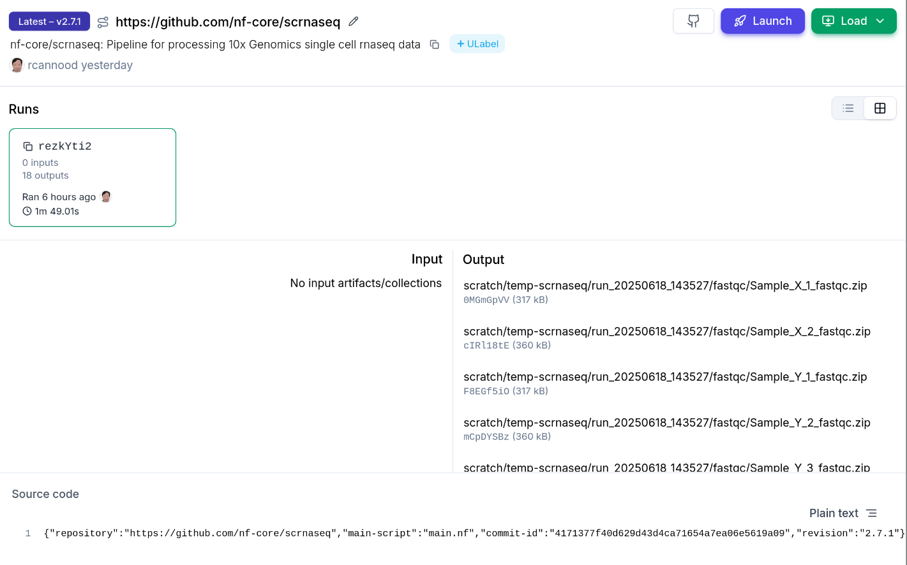

# Getting Started

To use the plugin, you need to configure it with your LaminDB instance
and API key. This setup allows the plugin to authenticate and interact
with your LaminDB instance, enabling it to record workflow runs and
associated metadata.

## Set API Key

Retrieve your Lamin API key from your [Lamin Hub account
settings](https://lamin.ai/settings) and set it as a Nextflow secret:

```bash
nextflow secrets set LAMIN_API_KEY <your-lamin-api-key>
```

## Configure the plugin

Add the following block to your `nextflow.config`:

```groovy
plugins {
  id 'nf-lamin'
}

lamin {
  instance = "<your-lamin-org>/<your-lamin-instance>"
  api_key = secrets.LAMIN_API_KEY
}
```

See the [Reference](reference) for more configuration options.

## Example Run with nf-core/scrnaseq

This guide shows how to register a Nextflow run with inputs & outputs
for the [nf-core/scrnaseq](https://nf-co.re/scrnaseq/latest) pipeline.

<div class="dropdown">

What steps are executed by the nf-core/scrnaseq pipeline?

<!-- The diagram is from the nf-core/scrnaseq GitHub repository. -->


</div>

### Run the pipeline

With the `nf-lamin` plugin configured, let’s run the `nf-core/scrnaseq`
pipeline on remote input data.

```bash
# The test profile uses publicly available test data
nextflow run nf-core/scrnaseq \
  -r "2.7.1" \
  -profile docker,test \
  -plugins nf-lamin \
  --outdir gs://di-temporary-public/scratch/temp-scrnaseq/run_$(date +%Y%m%d_%H%M%S)
```

<div class="dropdown">

What is the full command and output when running this command?

```bash
nextflow run nf-core/scrnaseq \
  -latest \
  -r "2.7.1" \
  -profile docker \
  -plugins nf-lamin@0.1.0 \
  --input https://github.com/nf-core/test-datasets/raw/scrnaseq/samplesheet-2-0.csv \
  --fasta https://github.com/nf-core/test-datasets/raw/scrnaseq/reference/GRCm38.p6.genome.chr19.fa \
  --gtf https://github.com/nf-core/test-datasets/raw/scrnaseq/reference/gencode.vM19.annotation.chr19.gtf \
  --protocol 10XV2 \
  --skip_emptydrops \
  --outdir gs://di-temporary-public/scratch/temp-scrnaseq/run_$(date +%Y%m%d_%H%M%S)
```

    Nextflow 25.04.4 is available - Please consider updating your version to it(B
    N E X T F L O W  ~  version 24.10.5
    Pulling nf-core/scrnaseq ...
    Launching `https://github.com/nf-core/scrnaseq` [goofy_curran] DSL2 - revision: 4171377f40 [2.7.1]
    ✅ Connected to LaminDB instance 'laminlabs/lamindata' as 'rcannood'
    Transform J49HdErpEFrs0000 (https://staging.laminhub.com/laminlabs/lamindata/transform/J49HdErpEFrs0000)
    Run p8npJ8JxIYazW4EkIl8d (https://staging.laminhub.com/laminlabs/lamindata/transform/J49HdErpEFrs0000/p8npJ8JxIYazW4EkIl8d)


    ------------------------------------------------------
                                            ,--./,-.
            ___     __   __   __   ___     /,-._.--~'
      |\ | |__  __ /  ` /  \ |__) |__         }  {
      | \| |       \__, \__/ |  \ |___     \`-._,-`-,
                                            `._,._,'
      nf-core/scrnaseq v2.7.1-g4171377
    ------------------------------------------------------
    Core Nextflow options
      revision       : 2.7.1
      runName        : goofy_curran
      containerEngine: docker
      launchDir      : /home/rcannood/workspace/laminlabs/nf-lamin/docs
      workDir        : /home/rcannood/workspace/laminlabs/nf-lamin/docs/work
      projectDir     : /home/rcannood/.nextflow/assets/nf-core/scrnaseq
      userName       : rcannood
      profile        : docker
      configFiles    : 

    Input/output options
      input          : https://github.com/nf-core/test-datasets/raw/scrnaseq/samplesheet-2-0.csv
      outdir         : gs://di-temporary-public/scratch/temp-scrnaseq/run_20250623_155222

    Mandatory arguments
      protocol       : 10XV2

    Skip Tools
      skip_emptydrops: true

    Reference genome options
      fasta          : https://github.com/nf-core/test-datasets/raw/scrnaseq/reference/GRCm38.p6.genome.chr19.fa
      gtf            : https://github.com/nf-core/test-datasets/raw/scrnaseq/reference/gencode.vM19.annotation.chr19.gtf

    !! Only displaying parameters that differ from the pipeline defaults !!
    ------------------------------------------------------
    If you use nf-core/scrnaseq for your analysis please cite:

    * The pipeline
      https://doi.org/10.5281/zenodo.3568187

    * The nf-core framework
      https://doi.org/10.1038/s41587-020-0439-x

    * Software dependencies
      https://github.com/nf-core/scrnaseq/blob/master/CITATIONS.md
    ------------------------------------------------------
    Staging foreign file: https://github.com/nf-core/test-datasets/raw/scrnaseq/reference/GRCm38.p6.genome.chr19.fa
    [aa/f28322] Submitted process > NFCORE_SCRNASEQ:SCRNASEQ:FASTQC_CHECK:FASTQC (Sample_X)
    [65/302656] Submitted process > NFCORE_SCRNASEQ:SCRNASEQ:FASTQC_CHECK:FASTQC (Sample_Y)
    Staging foreign file: https://github.com/nf-core/test-datasets/raw/scrnaseq/reference/gencode.vM19.annotation.chr19.gtf
    [b8/211c99] Submitted process > NFCORE_SCRNASEQ:SCRNASEQ:GTF_GENE_FILTER (GRCm38.p6.genome.chr19.fa)
    [3a/4fedfc] Submitted process > NFCORE_SCRNASEQ:SCRNASEQ:SCRNASEQ_ALEVIN:SIMPLEAF_INDEX (GRCm38.p6.genome.chr19_genes.gtf)
    [b9/3c7dea] Submitted process > NFCORE_SCRNASEQ:SCRNASEQ:SCRNASEQ_ALEVIN:SIMPLEAF_QUANT (Sample_X)
    [f9/7f4c04] Submitted process > NFCORE_SCRNASEQ:SCRNASEQ:SCRNASEQ_ALEVIN:SIMPLEAF_QUANT (Sample_Y)
    [c9/8acce0] Submitted process > NFCORE_SCRNASEQ:SCRNASEQ:SCRNASEQ_ALEVIN:ALEVINQC (Sample_X)
    [71/5ad2c7] Submitted process > NFCORE_SCRNASEQ:SCRNASEQ:MTX_CONVERSION:MTX_TO_SEURAT (Sample_X)
    [3e/5f5791] Submitted process > NFCORE_SCRNASEQ:SCRNASEQ:MTX_CONVERSION:MTX_TO_H5AD (Sample_X)
    [f5/8253b1] Submitted process > NFCORE_SCRNASEQ:SCRNASEQ:MTX_CONVERSION:MTX_TO_H5AD (Sample_Y)
    [06/b4393f] Submitted process > NFCORE_SCRNASEQ:SCRNASEQ:SCRNASEQ_ALEVIN:ALEVINQC (Sample_Y)
    [93/85f059] Submitted process > NFCORE_SCRNASEQ:SCRNASEQ:MTX_CONVERSION:MTX_TO_SEURAT (Sample_Y)
    [ec/5b908e] Submitted process > NFCORE_SCRNASEQ:SCRNASEQ:MTX_CONVERSION:CONCAT_H5AD (1)
    [34/6a57b0] Submitted process > NFCORE_SCRNASEQ:SCRNASEQ:MULTIQC
    Waiting for file transfers to complete (7 files)
    -[nf-core/scrnaseq] Pipeline completed successfully-

</div>

When you run this command, `nf-lamin` will print links to the
`Transform` and `Run` records it creates in Lamin Hub:

    ✅ Connected to LaminDB instance 'laminlabs/lamindata' as 'rcannood'
    Transform J49HdErpEFrs0000 (https://staging.laminhub.com/laminlabs/lamindata/transform/J49HdErpEFrs0000)
    Run p8npJ8JxIYazW4EkIl8d (https://staging.laminhub.com/laminlabs/lamindata/transform/J49HdErpEFrs0000/p8npJ8JxIYazW4EkIl8d)

### View transforms & runs on Lamin Hub

You can explore the run and its associated artifacts through Lamin Hub
or the Python package.

**Via Lamin Hub:**

- Transform:
  [J49HdErpEFrs0000](https://staging.laminhub.com/laminlabs/lamindata/transform/J49HdErpEFrs0000)
- Run:
  [p8npJ8JxIYazW4EkIl8d](https://staging.laminhub.com/laminlabs/lamindata/transform/J49HdErpEFrs0000/p8npJ8JxIYazW4EkIl8d)



**Via the Python package:**

```python
import lamindb as ln

ln.Run.get("p8npJ8JxIYazW4EkIl8d")
```

    Run(uid='p8npJ8JxIYazW4EkIl8d', name='trusting_brazil', started_at=2025-06-18 12:35:30 UTC, finished_at=2025-06-18 12:37:19 UTC, branch_id=1, space_id=1, transform_id=331, created_by_id=28, created_at=2025-06-18 12:35:33 UTC)
