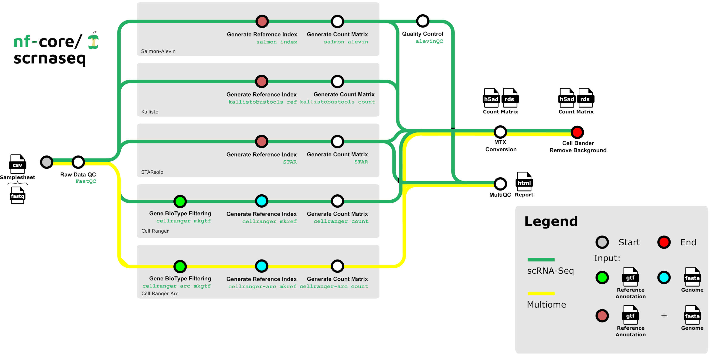

# Nextflow

There are several ways to track Nextflow pipeline runs and artifacts in [LaminDB](https://lamin.ai/).

## Using `nf-lamin` (recommended)

The [`nf-lamin`](https://github.com/laminlabs/nf-lamin) Nextflow plugin automatically tracks transforms, runs, and artifacts without modifying pipeline code. It requires a [LaminHub](https://lamin.ai/) account.

**1.** Store your [Lamin API key](https://lamin.ai/settings) as a Nextflow secret:

```bash
nextflow secrets set LAMIN_API_KEY <your-lamin-api-key>
```

**2.** Add the plugin to your `nextflow.config`:

```groovy
plugins {
  id 'nf-lamin'
}

lamin {
  instance = "your-org/your-instance"
  api_key = secrets.LAMIN_API_KEY
}
```

**3.** Run your pipeline:

```bash
nextflow run <your-pipeline>
```

After the run, explore the tracked data in LaminHub or via the Python SDK:

```python
import lamindb as ln

ln.Run.get("your-run-uid")
```


→ See {doc}`/api/config` for the full `nf-lamin` configuration reference.

→ See {doc}`/api/examples` for ready-to-run nf-core/rnaseq and bigbio/quantms configurations.

## Using a post-run script

If you want to use Nextflow with LaminDB but without [LaminHub](https://lamin.ai), and cannot modify the Nextflow workflow, you can register runs manually with a Python post-run script.

Note that this approach does not provide the same automation as `nf-lamin` (real-time run tracking, automatic artifact registration). It also cannot integrate with [Seqera Cloud](https://seqera.io/), which requires the `nf-lamin` plugin.

:::{dropdown} Example: nf-core/scrnaseq post-run registration



After running the pipeline, a Python script registers inputs & outputs in LaminDB:

```{eval-rst}
.. literalinclude:: guide/register_scrnaseq_run.py
   :language: python
   :caption: nf-core/scrnaseq run registration
```

Run it with:

```bash
python register_scrnaseq_run.py --input scrnaseq_input --output scrnaseq_output
```

Such a script can be deployed via:

1. A serverless environment trigger (e.g., AWS Lambda)
2. A [post-run script](https://docs.seqera.io/platform-cloud/launch/advanced#pre-and-post-run-scripts) on the Seqera Platform

:::
