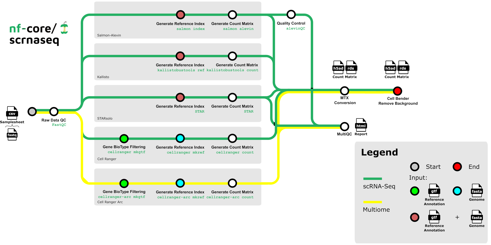

# Post-run script


[Nextflow](https://www.nextflow.io/) is the most widely used workflow manager in bioinformatics.

We generally recommend using the `nf-lamin` plugin.
However, if lower level LaminDB usage is required, it might be worthwhile writing a custom Python script.

This guide shows how to register a Nextflow run with inputs & outputs for the example of the [nf-core/scrnaseq](https://nf-co.re/scrnaseq/latest) pipeline by running a Python script.

The approach could be automated by deploying the script via

1. a serverless environment trigger (e.g., AWS Lambda)
2. a [post-run script](https://docs.seqera.io/platform/23.4.0/launch/advanced#pre-and-post-run-scripts) on the Seqera Platform


:::{dropdown} What steps are executed by the nf-core/scrnaseq pipeline?



:::

```python
!lamin init --storage ./test-nextflow --name test-nextflow
```

## Run the pipeline

Let's download the input data from an S3 bucket.

```python
import lamindb as ln

input_path = ln.UPath("s3://lamindb-test/scrnaseq_input")
input_path.download_to("scrnaseq_input")
```

And run the `nf-core/scrnaseq` pipeline.

```python
# the test profile uses all downloaded input files as an input
!nextflow run nf-core/scrnaseq -r 4.0.0 -profile docker,test -resume --outdir scrnaseq_output
```

:::{dropdown} What is the full run command for the test profile?

```
nextflow run nf-core/scrnaseq -r 4.0.0 \
    -profile docker \
    -resume \
    --outdir scrnaseq_output \
    --input 'scrnaseq_input/samplesheet-2-0.csv' \
    --skip_emptydrops \
    --fasta 'https://github.com/nf-core/test-datasets/raw/scrnaseq/reference/GRCm38.p6.genome.chr19.fa' \
    --gtf 'https://github.com/nf-core/test-datasets/raw/scrnaseq/reference/gencode.vM19.annotation.chr19.gtf' \
    --aligner 'star' \
    --protocol '10XV2' \
    --max_cpus 2 \
    --max_memory '6.GB' \
    --max_time '6.h'
```
:::


## Run the registration script


After the pipeline has completed, a Python script registers inputs & outputs in LaminDB.


```{eval-rst}
.. literalinclude:: register_scrnaseq_run.py
   :language: python
   :caption: nf-core/scrnaseq run registration
```

```python
!python register_scrnaseq_run.py --input scrnaseq_input --output scrnaseq_output
```

## Data lineage


The output data could now be accessed (in a different notebook/script) for analysis with full lineage.

```python
matrix_af = ln.Artifact.get(key__icontains="filtered_count_matrix.h5ad")
```

```python
matrix_af.view_lineage()
```

## View transforms & runs on the hub

[](https://lamin.ai/laminlabs/lamindata/transform/cpMwOcY2YJ5G0000/214dWyrIPWHX7pg24EDR)


```python
# clean up the test instance:
!rm -rf test-nextflow
!lamin delete --force test-nextflow
```
