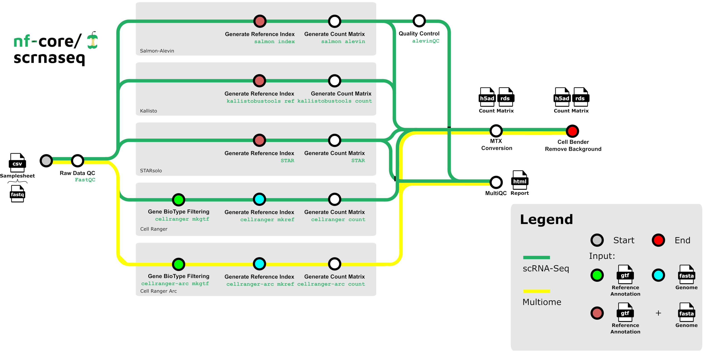
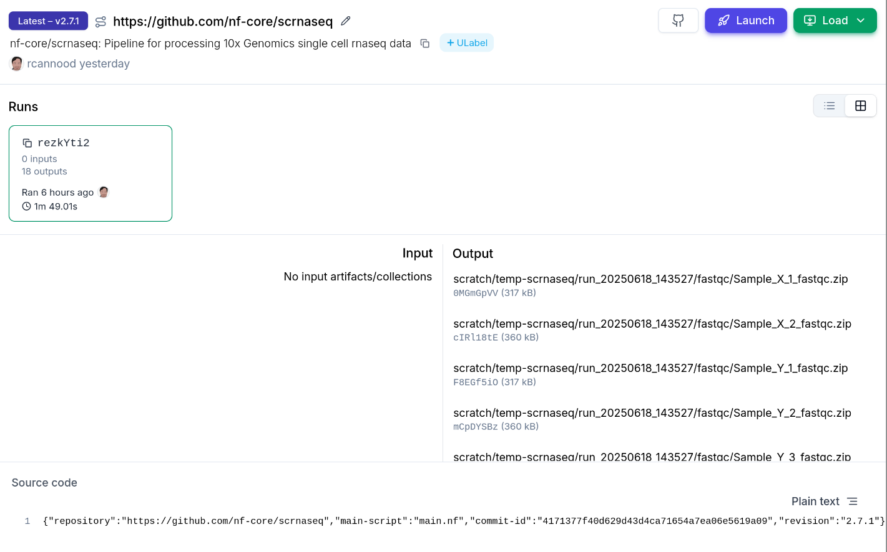

# Nextflow

[Nextflow](https://www.nextflow.io/) is the most widely used workflow manager in bioinformatics.

This guide shows how to register a [nf-core/scrnaseq](https://nf-co.re/scrnaseq/latest) Nextflow run using the `nf-lamin` plugin.
See {doc}`nextflow-postrun` learn how to register a Nextflow run using a post-run script.

To use the `nf-lamin` plugin, you need to configure it with your LaminDB instance and API key.
This setup allows the plugin to authenticate and interact with your LaminDB instance, enabling it to record workflow runs and associated metadata.

## Set API Key

Retrieve your Lamin API key from your [Lamin Hub account settings](https://lamin.ai/settings) and set it as a Nextflow secret:

<!-- #region -->

```bash
nextflow secrets set LAMIN_API_KEY <your-lamin-api-key>
```

<!-- #endregion -->

## Configure the plugin

Add the following block to your `nextflow.config`:

<!-- #region -->

```groovy
plugins {
  id 'nf-lamin'
}

lamin {
  instance = "<your-lamin-org>/<your-lamin-instance>"
  api_key = secrets.LAMIN_API_KEY
}
```

<!-- #endregion -->

See {doc}`nextflow-plugin-reference` for more configuration options.

## Example Run with nf-core/scrnaseq

This guide shows how to register a Nextflow run with inputs & outputs for the [nf-core/scrnaseq](https://nf-co.re/scrnaseq/latest) pipeline.

### Run the pipeline

With the `nf-lamin` plugin configured, let’s run the `nf-core/scrnaseq` pipeline on remote input data.

```python
# The test profile uses publicly available test data
!nextflow run nf-core/scrnaseq \
  -r "4.0.0" \
  -profile docker,test \
  -plugins nf-lamin \
  --outdir s3://lamindb-ci/nf-lamin/run_$(date +%Y%m%d_%H%M%S)
```

<!-- #region -->

:::{dropdown} What is the full command and output when running this command?

```bash
nextflow run nf-core/scrnaseq \
  -r "4.0.0" \
  -profile docker \
  -plugins nf-lamin \
  --input https://github.com/nf-core/test-datasets/raw/scrnaseq/samplesheet-2-0.csv \
  --fasta https://github.com/nf-core/test-datasets/raw/scrnaseq/reference/GRCm38.p6.genome.chr19.fa \
  --gtf https://github.com/nf-core/test-datasets/raw/scrnaseq/reference/gencode.vM19.annotation.chr19.gtf \
  --protocol 10XV2 \
  --aligner star \
  --skip_cellbender \
  --outdir s3://lamindb-ci/nf-lamin/run_$(date +%Y%m%d_%H%M%S)
```

:::

<!-- #endregion -->

:::{dropdown} What steps are executed by the nf-core/scrnaseq pipeline?

<!-- The diagram is from the nf-core/scrnaseq GitHub repository. -->



:::

When you run this command, `nf-lamin` will print links to the `Transform` and `Run` records it creates in Lamin Hub:

```
✅ Connected to LaminDB instance 'laminlabs/lamindata' as 'user_name'
Transform J49HdErpEFrs0000 (https://staging.laminhub.com/laminlabs/lamindata/transform/J49HdErpEFrs0000)
Run p8npJ8JxIYazW4EkIl8d (https://staging.laminhub.com/laminlabs/lamindata/transform/J49HdErpEFrs0000/p8npJ8JxIYazW4EkIl8d)
```

### View transforms & runs on Lamin Hub

You can explore the run and its associated artifacts through Lamin Hub or the Python package.

#### Via Lamin Hub

- Transform:
  [J49HdErpEFrs0000](https://staging.laminhub.com/laminlabs/lamindata/transform/J49HdErpEFrs0000)
- Run:
  [p8npJ8JxIYazW4EkIl8d](https://staging.laminhub.com/laminlabs/lamindata/transform/J49HdErpEFrs0000/p8npJ8JxIYazW4EkIl8d)




#### Using LaminDB

<!-- #region -->

```python
import lamindb as ln

# Make sure you are connected to the same instance
# you configured in nextflow.config

ln.Run.get("p8npJ8JxIYazW4EkIl8d")
```

This will display the details of the run record in your notebook:

```
Run(uid='p8npJ8JxIYazW4EkIl8d', name='trusting_brazil', started_at=2025-06-18 12:35:30 UTC, finished_at=2025-06-18 12:37:19 UTC, transform_id='aBcDeFg', created_by_id=..., created_at=...)
```

<!-- #endregion -->

```{toctree}
:maxdepth: 1
:hidden:

nextflow-plugin-reference
nextflow-postrun
```
