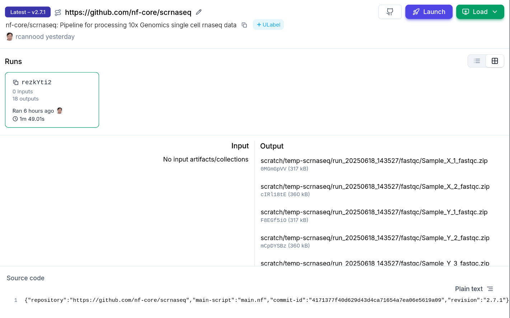

# Nextflow

**`nf-lamin`** is a Nextflow plugin that automatically records data provenance for your workflows in [LaminDB](https://lamin.ai/). Without modifying any pipeline code, it tracks:

- **Transforms** — the pipeline definition (repository, script, version)
- **Runs** — each execution (parameters, timing, status)
- **Artifacts** — input and output files, linked to the run

## Version Compatibility

| nf-lamin  | LaminDB       | Nextflow   | Status         | Key Features                                                      |
| --------- | ------------- | ---------- | -------------- | ----------------------------------------------------------------- |
| **0.5.2** | >= 2.0        | >= 25.10.0 | ✅ Supported   | Configure artifact keys via templates, closures, or Map shorthand |
| 0.5.1     | >= 2.0        | >= 25.10.0 | ❌ Unsupported | Track local input files, exclude work and assets directories      |
| 0.5.0     | >= 2.0        | >= 25.10.0 | ❌ Unsupported | Improved config, artifact tracking rules, metadata tagging        |
| 0.4.0     | >= 2.0        | >= 25.10.0 | ❌ Unsupported | Input artifact tracking                                           |
| 0.3.0     | >= 2.0        | >= 25.04.0 | ❌ Unsupported | Upgrade to LaminDB v2, `lamin://` URI support                     |
| 0.2.x     | >= 1.0, < 2.0 | >= 25.04.0 | ❌ Unsupported | Reports, `getRunUid()`, `getTransformUid()`, `getInstanceSlug()`  |
| 0.1.0     | >= 1.0, < 2.0 | >= 24.04.0 | ❌ Unsupported | Transform & Run tracking, output artifact registration            |

## Quick Start

**1.** Retrieve your API key from [lamin.ai/settings](https://lamin.ai/settings) and store it as a Nextflow secret:

```bash
nextflow secrets set LAMIN_API_KEY <your-lamin-api-key>
```

**2.** Add the plugin to your `nextflow.config`:

```groovy
plugins {
  id 'nf-lamin'
}

lamin {
  instance = "your-org/your-instance"
  api_key = secrets.LAMIN_API_KEY
}
```

**3.** Run your pipeline as usual:

```bash
nextflow run <your-pipeline>
```

The plugin prints links to the Transform and Run records it creates:

```
✅ Connected to LaminDB instance 'your-org/your-instance' as 'your-username'
Transform XXXYYYZZZABC0001 (https://lamin.ai/your-org/your-instance/transform/XXXYYYZZZABC0001)
Run abcdefghijklmnopqrst (https://lamin.ai/your-org/your-instance/transform/XXXYYYZZZABC0001/abcdefghijklmnopqrst)
```

## Artifact Tracking

By default, all published output files are tracked as artifacts and linked to the run. The most common configuration for nf-core-style pipelines is to strip the output directory prefix from artifact keys:

```groovy
lamin {
  output_artifacts {
    key = [relativize: params.outdir]
  }
}
```

This stores `multiqc/star/multiqc_report.html` as the artifact key instead of just the filename, preserving the directory structure of your results.

→ See {doc}`nextflow-plugin-reference` for the full configuration reference, including input artifact tracking, metadata tagging, and pattern-based rules.

→ See {doc}`nextflow-functions` for DSL functions (`getRunUid`, `getTransformUid`, `getInstanceSlug`) and `lamin://` URI support.

## Viewing Results

After the run, explore the tracked data in Lamin Hub or via the Python SDK:

```python
import lamindb as ln

ln.Run.get("your-run-uid")
```



## Examples

Ready-to-run configurations for popular Nextflow pipelines:

→ See {doc}`nextflow-examples` for nf-core/rnaseq and bigbio/quantms.

```{toctree}
:maxdepth: 1
:hidden:

nextflow-plugin-reference
nextflow-functions
nextflow-examples
nextflow-postrun
```
